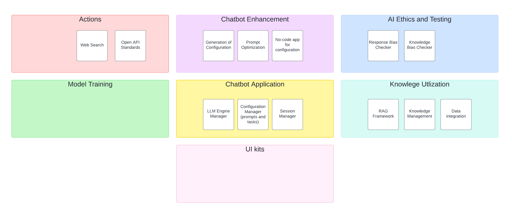

# Documentation of Long Term Vision for BabbleBeaver

Our initial work for BabbleBeaver will focus on the Chatbot Application.
We envision adding much more functionality once that is complete, such as knowledge utilization with RAGs, testing of AI ethics, actions with API integrations, and ways to develop low-code applications.

# Knowledge Utilization

This will be modules to create a RAG-based chatbot and modules to handle the processing of the data.

* allow for semantic search
* modification of query prompts
* connection with existing vector databases or index

We would also like to create ways to manage the knowledge.

* transactional system for SMEs to record their knowledge.
* like chatbot configuration of LLM, configuration of embedding models
* secondary data system (data that doesn't feed into the RAG but helps navigate the knowledge better)

# AI Ethics and Testing

* testing toolkit for checking on chatbot
* testing should include not only "unit tests" but some way to do in-situ tests that look at the evolution of a conversation (many-shots)
* bias checks with colloquisms
* hallucination evaluator

# Actions

* chat prompts turn into API calls
* integrate with any OpenAPI 

# Chatbot Enhancement

* low-code ways to change the configuratio of a deployed chatbot
* prompt optimiztion
* AI generation of configuration
* checking and blocking for inappropriate use of chatbot

# Model Training

# UI Kits

